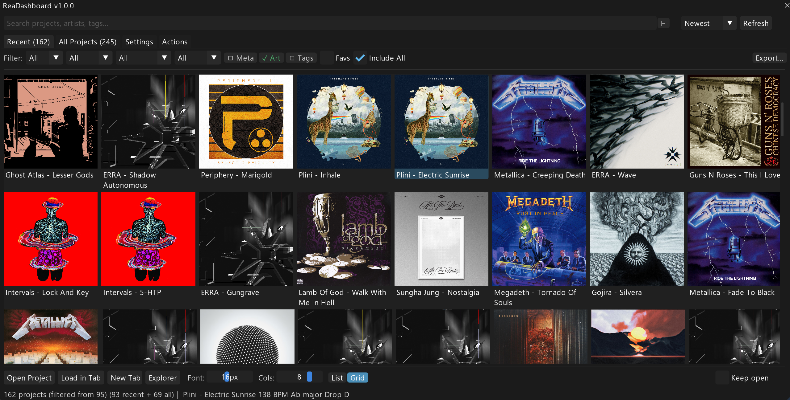
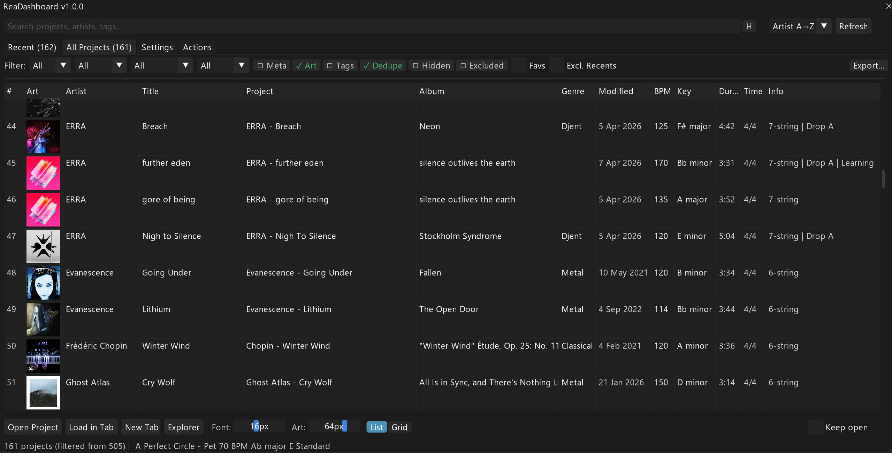
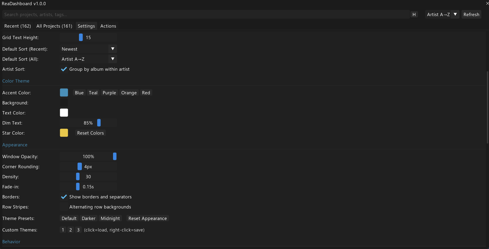

# ReaDashboard

A modern, feature-rich project dashboard for [REAPER](https://www.reaper.fm/), built with [ReaImGui](https://forum.cockos.com/showthread.php?t=250419).

Browse, search, filter, and manage your REAPER projects with album art, metadata, custom tags, and more.

# Screenshots

   
  <em>Grid View</em>

 

   
  <em>List View</em>

 

   
  <em>Settings Menu</em>

                            
# Note

This was built for my personal use and is optimized for my workflow: I'm a guitarist who learns/covers a lot of songs.

## Features

- **Recent & All Projects** - Browse recent projects from REAPER's history or scan an entire folder tree
- **Grid & List Views** - Switch between a visual grid with album art or a detailed sortable table
- **Search & Filters** - Full-text search across project names, artists, albums, tags, and more. Filter by string count, tuning, status, genre, favorites, and metadata coverage
- **Custom Tags** - Tag projects with status (Learning, Complete, etc.), tuning, difficulty, strings, guitar, amp, and free-text notes
- **Metadata** - Can manually add all metadata tags. BPM and time signature are auto extracted from project files
- **Album Art** - Place `cover.jpg`, `cover.png`, `folder.jpg`, `folder.png`, or `art.jpg` in your project folder to display as album art. If only one image is in a folder, it is auto-selected regardless of name.
- **Keyboard Navigation** - Full keyboard support with arrow keys, Enter to open, and search history
- **Theming** - Customizable accent colors, dark mode, window opacity, and corner rounding
- **Export** - Export project lists as CSV, Markdown, or JSON
- **Spicetify Integration** (Optional) - Enrich projects with metadata from a local Spicetify database

## Requirements

- **REAPER** v5.0+ (v6+ recommended)
- **ReaImGui** - Install via ReaPack (`Extensions > ReaPack > Browse packages`, search "ReaImGui")
- **SWS Extension** - Required for clipboard, file browsing, and project management features. [Download SWS](https://www.sws-extension.org/)
- **js_ReaScriptAPI** (Recommended) - Install via ReaPack for fast file info lookups

## Installation

1. **ReaPack (Recommended):** `Extensions > ReaPack > Import repositories` and paste `https://github.com/AnshulJ999/REAPER-ReaScripts/raw/main/index.xml`
2. Browse packages, search for "ReaDashboard", and click Install
3. Make sure you have the required extensions above installed via ReaPack
4. Assign a keyboard shortcut for quick access (recommended) and set it up as a startup action

## First Launch

1. Open Settings (the Settings tab at the top)
2. Set **Projects Folder** to the root folder containing your `.rpp` files
3. Adjust **Max Scan Depth** if your projects are nested deeper than the default
4. Press **Shift+F5** (or Right-Click the Refresh button) to Hard Refresh. This scans the folder and builds the metadata cache. **Note:** You must Hard Refresh anytime you manually add new album art or externally edit tags.

The **Recent** tab works immediately with no configuration - it reads directly from REAPER's recent projects list.

## Keyboard Shortcuts

| Shortcut | Action |
|---|---|
| `F5` | Refresh (uses cached data) |
| `Shift+F5` | Hard Refresh (re-scans everything) |
| `Enter` | Open selected project |
| `Double-click` | Open project |
| `Up / Down` | Navigate project list (in grid: move by row) or cycle search history |
| `Left / Right` | Navigate grid columns |
| `Home / End` | Jump to first or last project |
| `Tab` | Toggle focus between search bar and project list |
| `Ctrl+Down/Up` | Jump focus from search bar to project list |
| `Ctrl+F` or `/` | Focus search bar |
| `Escape` (in search) | Unfocus search bar without closing window |
| `Enter` (in search) | Open selected / first result directly |
| `Ctrl+A` | Select all visible projects |
| `Ctrl+C` | Copy selected project path(s) |
| `Ctrl+Click` | Toggle project in/out of selection |
| `Shift+Click` | Range select |
| `Ctrl+Tab` | Cycle between Recent and All Projects |
| `Ctrl+1 / 2 / 3 / 4` | Switch to Recent / All / Settings / Actions tab |
| `Ctrl+B` | Close or hide the launcher |
| `Escape` | Clear multi-select, or close (if enabled in Settings) |
| `Shift+Esc / Ctrl+Q` | Force-quit — fully exits script, bypasses persistent mode |

## FAQs

### Will this script automatically fetch metadata and art for all my projects? 

No, the script does not automatically fetch metadata and art. For now, it requires you to manually set up metadata and tags yourself. The only thing it auto-fetches is project BPM and Time Signature.

Automatic enrichment is possible via a complex integration with SyncLyrics and Spicetify.

## Known Limitations

- **Unique filenames required**: The script identifies projects by their filename. If two projects in different folders have the same `.rpp` filename, they will share metadata. Ensure project files have unique names across directories.
- **Spicetify integration is optional**: Most users will not have a Spicetify database. The script is fully functional without it - BPM, key, and other metadata can be overridden manually via tags.

Based on [ReaLauncher's](https://forum.cockos.com/showthread.php?t=244541) concept by solger.
